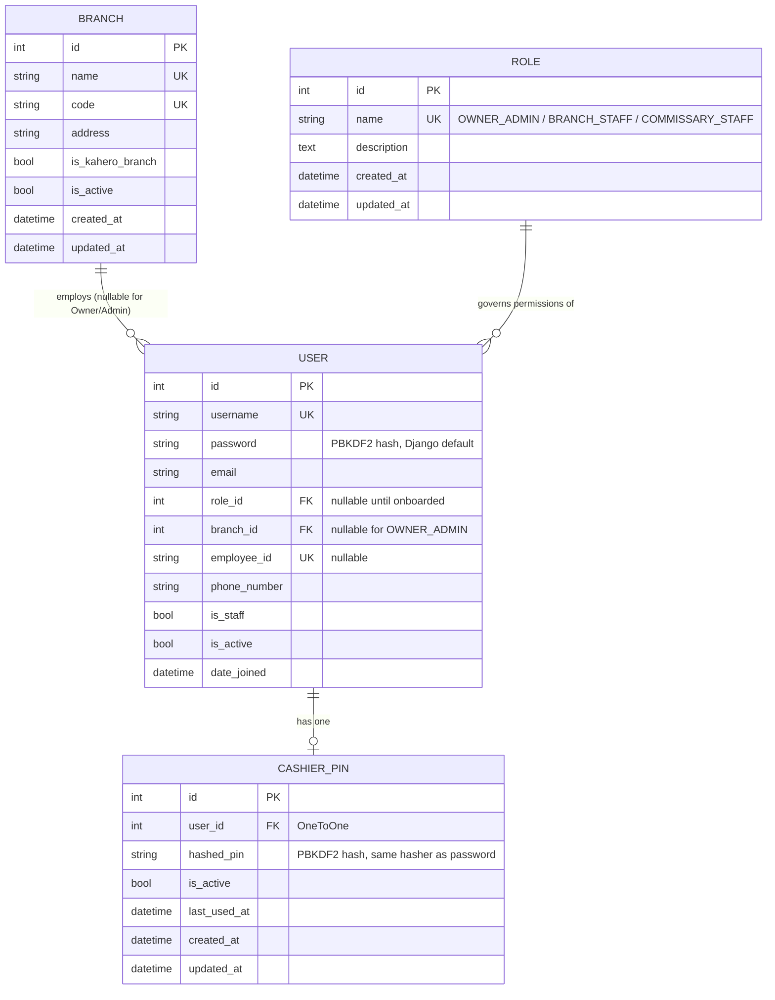

# SanServeAll — Accounts Schema ERD (Week 2 / Row 13)

Covers the models implemented in Row 9 (`apps/accounts/models.py`, `apps/core/models.py`). This is the **foundation layer** of the full ERD from Phase 1 §6 — later weeks (POS, Inventory, Production, KaHero, Analytics, Forecasting) will extend this document as their own models land, per the Phase 9 timeline.

---

## Diagram

---

## Entity Notes

### `BRANCH`
Represents one of the three physical locations (Batangas City, Alangilan, Lipa City).

- **`is_kahero_branch`** is the single source of truth for which branch runs batch-import mode. This directly replaces what would otherwise be a hardcoded `if branch_name == "Alangilan"` scattered across the codebase — the confirmed answer (Alangilan, per Phase 2's resolved client contradiction) is set **once**, as data, at seed time. Every other app that needs this distinction (POS's real-time-vs-batch logic, KaHero's ingestion pipeline) queries this flag instead of comparing branch names.
- `code` exists as a short, stable identifier (`BATANGAS`, `ALANGILAN`, `LIPA`) for use in logs, config, and anywhere a human-readable-but-URL-safe reference is more convenient than the numeric PK.

### `ROLE`
Implements the three roles defined in Phase 1 §2: `OWNER_ADMIN`, `BRANCH_STAFF`, `COMMISSARY_STAFF`. Kept as a proper table (rather than a plain `choices` field directly on `User`) to match the original ERD design in Phase 1 §6 — this leaves room for per-role metadata (e.g., a future `description` used in an admin-facing role picker) without a migration to change the field type later.

### `USER`
Extends Django's built-in `AbstractUser` rather than replacing the auth system — this was a deliberate Phase 3 decision so PBKDF2 password hashing and all of Django's standard auth machinery (login, password reset, session handling) keep working unmodified. Two FKs added on top:
- `role` — nullable only transiently, during onboarding before a role is assigned; should be non-null for any active user.
- `branch` — nullable specifically and permanently for `OWNER_ADMIN` users, who are not scoped to a single branch and need visibility across all three (per Phase 1 §2.1).

### `CASHIER_PIN`
A deliberately separate, lightweight table — **not** a second authentication system. It's a `OneToOne` extension of `User`, holding a PIN hashed with Django's own password hasher (so it gets the same PBKDF2 protection as the account password, no custom crypto). This models the Phase 2 design decision precisely: the PIN unlocks POS actions for an *already-logged-in* branch session, it does not replace the login step.

---

## What's Deliberately Not Modeled Yet

- **2FA** — `django-otp`'s own models (`TOTPDevice`, etc.) handle this; no custom field needed on `User` for it. Enrollment flow lands in Week 3 (Row 14+).
- **Branch-scoping enforcement** — the `branch` FK exists on `User`, but the actual middleware that restricts a `BRANCH_STAFF` user's queries to their own branch's data is a Week 3 item (`apps/core/middleware.py`), not part of the schema itself.
- All non-`accounts` entities (`SalesTransaction`, `Product`, `Inventory`, `ProductionRecord`, `KaheroImportBatch`, `Forecast`, etc.) — these belong to later weeks per the Phase 9 timeline and will each get their own ERD addendum as they're implemented, then folded into a single consolidated diagram once the schema is complete.

---

## Verification Performed (Row 9, referenced here since this doc describes that work)

- `python manage.py check` — 0 issues
- `python manage.py migrate` — applies `accounts.0001_initial` cleanly against SQLite alongside Django's own `auth`/`admin`/`otp_totp`/`sessions` migrations
- Functional smoke test: seeded the 3 real branches, confirmed `is_kahero_branch` resolves correctly to Alangilan only, created a `BRANCH_STAFF` user, set and verified a `CashierPIN` (confirmed the stored value is a `pbkdf2_*` hash, not plaintext)
