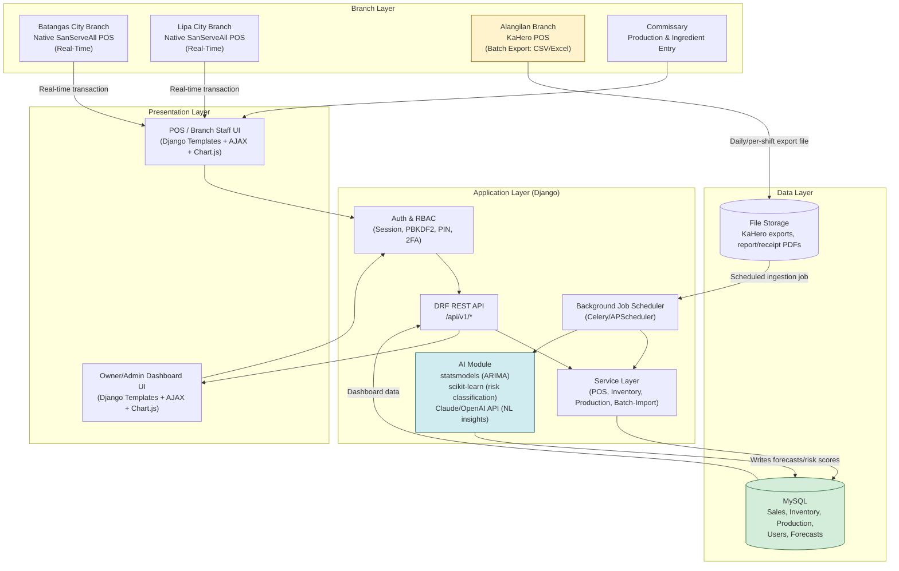

# SanServeAll — Phase 2: System Architecture

**Confirmed branch configuration (per client confirmation):**
- `KAHERO_BRANCH = "Alangilan"` → batch-import mode (scheduled CSV/Excel ingestion)
- **Batangas City** and **Lipa City** → native SanServeAll POS, real-time mode

This is treated as a single named config value everywhere in the design below (not hardcoded per-feature), so it can be changed later without restructuring the architecture.

---

## 1. Architecture Style

**Chosen style: Three-Tier / Client-Server Architecture, with Django's MVT (Model-View-Template) pattern on the backend, plus a decoupled REST API sub-layer for dashboard/AJAX data.**

### Why this style (not a full SPA / microservices architecture)

| Consideration | Reasoning |
|---|---|
| **Scale of the business** | 3 branches, ~80–100 transactions/branch/day, 15+ staff total. This is SME-scale — microservices would add operational overhead (multiple deployments, service discovery, inter-service auth) with no real payoff at this volume. |
| **Dual sync modes** | The system must handle **real-time** writes (native POS branches) and **batch** writes (KaHero branch) into the *same* consolidated data model. A three-tier design with one authoritative backend + one database keeps this consistent — a distributed/microservices split would force eventual-consistency handling that this project doesn't need. |
| **Manuscript-specified stack** | The paper already commits to Django + MySQL + server-rendered templates + Chart.js. Three-tier/MVT is the natural fit for that stack rather than forcing a SPA architecture (React/Vue) that the defended paper doesn't describe. |
| **AI workload isolation** | ARIMA/scikit-learn jobs must run **decoupled** from live POS traffic (explicit requirement in the manuscript). Three-tier with a background job layer (see §2.3) achieves this without needing a separate microservice. |
| **Academic/timeline constraints** | Capstone timeline and single-adviser review process favor one cohesive, explainable codebase over a distributed system that's harder to defend module-by-module in an oral panel. |

**Pattern used inside the Application layer:** Django's native **MVT** (Model–View–Template) — functionally equivalent to MVC (Template ≈ View in classic MVC terms, Django "View" ≈ Controller). Business logic further organized using a **service-layer pattern** on top of MVT: Views stay thin (HTTP concerns only), Models stay data-only, and a `services/` layer per Django app holds business rules (stock deduction logic, batch-import parsing, forecast triggering) — this keeps the codebase testable and avoids "fat models / fat views" anti-patterns as the system grows.

---

## 2. Architecture Layers

### 2.1 Presentation Layer (Client)
- **Server-rendered Django templates** (HTML5/CSS3, Bootstrap 5) for full-page views: login, branch selection, admin dashboard shell, settings screens.
- **AJAX/fetch-driven partial updates** (vanilla JS + Chart.js) for anything that needs to feel "live" without a full reload: POS ordering screen, analytics dashboards, inventory tables, forecast widgets.
- **Cashier PIN layer**: a lightweight secondary auth step (not a full login) rendered as a modal/screen after branch selection, scoped to unlocking POS actions for that session.
- Two logically separate UI surfaces sharing the same frontend stack:
  - **Branch/POS surface** — used by Cashier + Commissary Staff (branch-scoped).
  - **Admin/Owner surface** — dashboards, analytics, forecasting, settings (cross-branch, branch-filterable).

### 2.2 Application Layer (Backend)
- **Django (Python)** — routing, auth/session management, RBAC enforcement, template rendering.
- **Django REST Framework (DRF)** — JSON API endpoints consumed by the JS dashboard layer (Chart.js data feeds, POS AJAX actions, forecast widget data).
- **Service layer** (per Django app: `pos/`, `inventory/`, `production/`, `analytics/`, `accounts/`) — encapsulates:
  - Real-time sale → inventory deduction logic (native POS branches)
  - KaHero batch-import parsing/validation/ingestion pipeline (Alangilan)
  - Inventory risk / reorder-threshold evaluation
  - Forecast-trigger orchestration (calls the AI job layer, doesn't compute forecasts inline)
- **Background job layer** — a scheduler (Celery + Redis, or APScheduler for a lighter footprint at this scale — decision flagged for Phase 3) runs:
  - ARIMA forecasting (statsmodels)
  - Inventory risk classification (scikit-learn)
  - Natural-language insight generation (Claude API / OpenAI API call)
  - Scheduled KaHero batch-file ingestion (daily/per-shift)
  - All of these write results into dedicated result tables (`FORECAST`, `ANALYTICS_DATA`, `INVENTORY_RISK`) — the live dashboard **reads pre-computed results**, it never triggers a synchronous ARIMA run on page load.

### 2.3 Data Layer
- **MySQL** — production, single centralized relational database, normalized schema, PK/FK constraints, branch-tagged rows (`branch_id`) on every operational table so all branches share one schema instead of per-branch databases.
- **SQLite** — local development / prototyping only (matches manuscript Table 3-3), never production.
- **File storage** (see §2.5) for uploaded KaHero export files and generated receipt/report exports — kept *out* of MySQL as blobs; DB stores file references/paths only.

### 2.4 Authentication & Authorization
- **Django's built-in auth system** (`django.contrib.auth`) as the base — session-based auth for the server-rendered surface, PBKDF2 password hashing (Django's default hasher, matches manuscript requirement directly, no custom crypto needed).
- **Custom `Role` model + RBAC middleware/decorators** on top of Django's groups/permissions — three primary roles: `OWNER_ADMIN`, `BRANCH_STAFF`, `COMMISSARY_STAFF`, each scoped via a `branch_id` (nullable for `OWNER_ADMIN`, who sees all branches).
- **Cashier PIN** — a separate, short-lived, numeric secondary credential tied to a `BRANCH_STAFF` user, checked at POS-action time (not a Django `login()` — implemented as a session flag "POS unlocked" scoped to that branch session, expiring on logout/shift-end).
- **2FA for Admin/Owner accounts** — TOTP-based (e.g., `django-otp`), optional but recommended, matches the manuscript's System Configuration screen (2FA toggle).
- **API auth**: DRF endpoints authenticated via Django session + CSRF token (since the frontend is same-origin server-rendered + AJAX, not a separate SPA domain) — no need for JWT/OAuth complexity at this scale.

### 2.5 Storage
- **Relational data** → MySQL (primary source of truth).
- **Uploaded files** (KaHero CSV/Excel exports) → server-local `media/` storage in dev; cloud object storage (e.g., S3-compatible bucket) in production if the PaaS host doesn't provide persistent disk (relevant for Render, which has ephemeral filesystems on free/standard tiers — flagged as a hosting decision in Phase 3).
- **Generated exports** (PDF/CSV reports, printed receipts as PDF) → same storage strategy, referenced by DB row, not stored as DB blobs.

### 2.6 API Layer
- **DRF REST API**, versioned under `/api/v1/`, JSON in/out.
- Grouped by domain: `/api/v1/pos/`, `/api/v1/inventory/`, `/api/v1/production/`, `/api/v1/analytics/`, `/api/v1/forecast/`, `/api/v1/accounts/`.
- Read endpoints power dashboards/Chart.js; write endpoints power POS actions (create sale, adjust stock) and batch-import triggers.
- Batch-import endpoint accepts file upload (KaHero export) → queues a background job → returns job status, not a synchronous result (imports can be large; must not block the request).

### 2.7 Hosting
- **PythonAnywhere or Render** (both explicitly named in the manuscript's own tech table, Table 3-3) — cloud PaaS, matches the "standard web hosting" scope constraint (no custom infra/hardware).
- Single environment initially (capstone scope); production/staging split recommended if timeline allows (formalized in Phase 6/9).

---

## 3. Architecture Diagram (Mermaid)

**Diagram notes:**
- Alangilan is visually distinguished (batch path) from Batangas City / Lipa City (real-time path) — this makes the config-driven distinction obvious to anyone reading the diagram, and easy to re-color/relabel if the branch assignment changes again.
- The AI module never sits in the direct request path of a POS transaction — it only reads from and writes to MySQL via scheduled jobs, then the dashboard reads MySQL like any other data.

---

## 4. Key Architectural Decisions Needing Your Input Before Phase 3

1. **Background job scheduler**: Celery + Redis (more robust, more moving parts to deploy on a PaaS) vs. APScheduler (simpler, in-process, less infra — better fit for capstone timeline/hosting constraints)?
2. **File storage for KaHero uploads/exports**: local disk (fine on PythonAnywhere, risky on Render's ephemeral filesystem) vs. cloud object storage (S3-compatible)?
3. **Staging vs. single environment**: does the panel/adviser expect a separate staging environment, or is one production environment acceptable for capstone defense purposes?

I'll propose defaults for these in Phase 3 (Technology Stack) unless you want to decide now.
